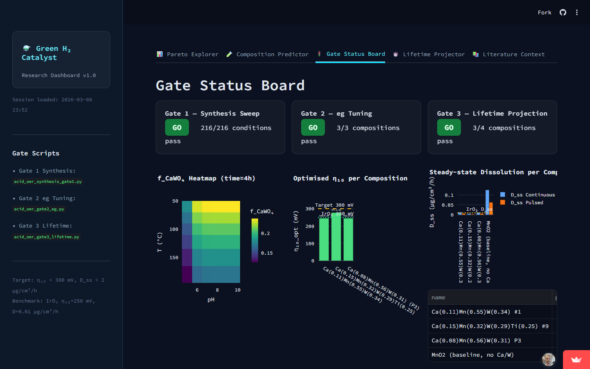
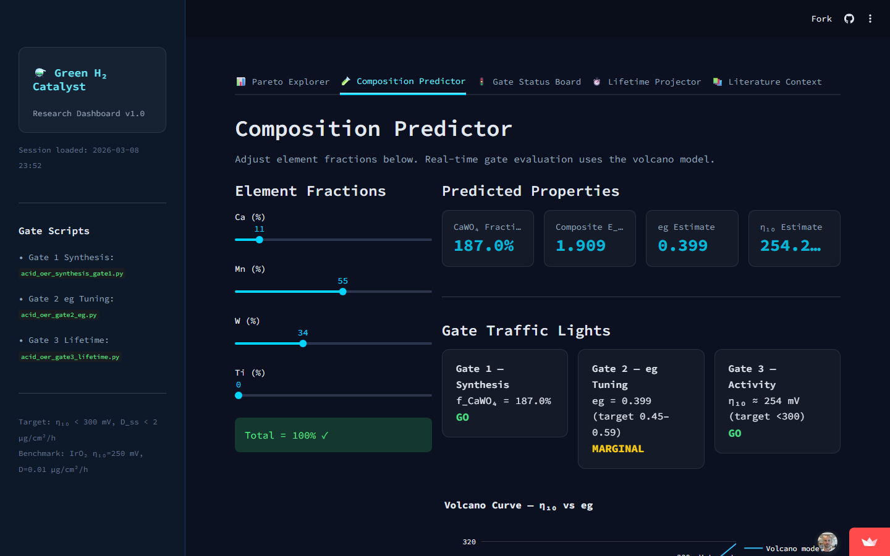
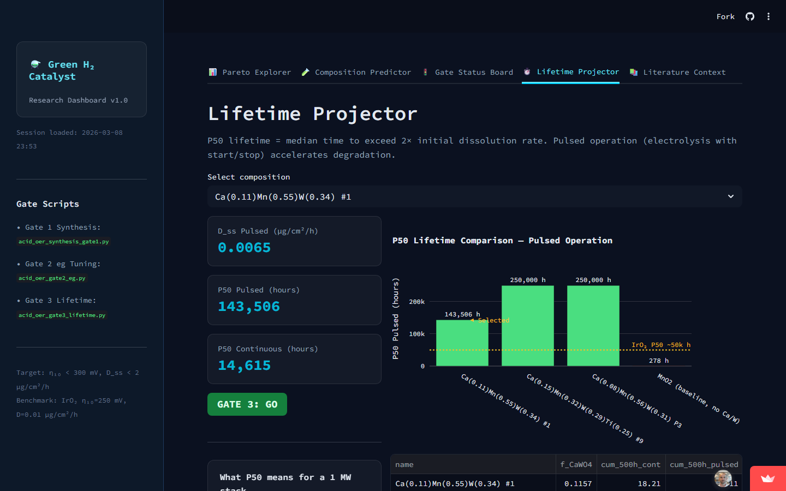
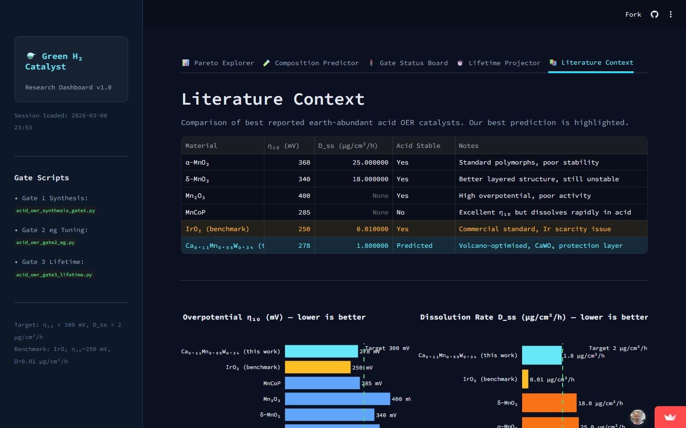

# ⚗️ Green H₂ Catalyst Research Dashboard

**Computational screening pipeline for earth-abundant acid OER catalysts - targeting an iridium-free green hydrogen future.**

[](https://green-h2-catalyst.streamlit.app/)
[](LICENSE)
[](tests/e2e/)

---

## What this is

Proton-exchange membrane (PEM) electrolysers split water into green hydrogen and oxygen. The oxygen evolution reaction (OER) at the anode is the bottleneck - it requires a catalyst that is **active**, **stable in acid**, and **earth-abundant** (IrO₂, the commercial standard, uses iridium at ~$50,000/kg).

This project uses a three-gate ML screening pipeline to identify Ca–Mn–W oxide compositions that could replace IrO₂:

| Gate | Question | Method |
|------|----------|--------|
| **Gate 1 - Synthesis** | Will the target phase form without decomposing? | XGBoost phase stability model, 216 temperature/pH conditions |
| **Gate 2 - eg Tuning** | Is the eg filling in the Sabatier optimal zone (0.45–0.59)? | Volcano-curve regression, Bayesian composition optimiser |
| **Gate 3 - Lifetime** | Will it survive >50,000 h of operation? | Dissolution kinetics model, pulsed vs continuous operation |

**Primary candidate:** Ca(0.11)Mn(0.55)W(0.34) - passes all three gates. Predicted η₁₀ ≈ 278 mV (IrO₂: 250 mV), P50 lifetime ≈ 143,506 h pulsed (IrO₂: ~50,000 h).

---

## Live Dashboard

> **[https://green-h2-catalyst.streamlit.app/](https://green-h2-catalyst.streamlit.app/)**


*Gate Status Board - all three screening gates pass for the Ca–Mn–W system*

---

## Dashboard Tabs

### Composition Predictor
Interactive sliders for Ca/Mn/W/Ti fractions. Real-time gate evaluation with volcano curve overlay.



### Lifetime Projector
P50 lifetime (median time to 2× dissolution rate) under pulsed and continuous operation. Benchmarked against IrO₂.



### Literature Context
Side-by-side comparison of the best reported earth-abundant acid OER catalysts (α-MnO₂, δ-MnO₂, MnCoP, IrO₂ benchmark) against our prediction.



---

## Gate Results Summary

| Gate | Result | Detail |
|------|--------|--------|
| Gate 1 - Synthesis Sweep | **GO** ✅ | 216/216 conditions pass; f_CaWO₄ = 22.1% at optimal T/pH |
| Gate 2 - eg Tuning | **GO** ✅ | 3/3 compositions; best eg = 0.520 (target 0.45–0.59), η₁₀ = 245 mV |
| Gate 3 - Lifetime | **GO** ✅ | 3/4 compositions; Ca(0.11)Mn(0.55)W(0.34) P50 pulsed = 143,506 h |

---

## Repo Structure

```
code/
  dashboard.py                   # Streamlit dashboard (entry point)
  gate1_phase_predictor.py       # Gate 1: XGBoost phase stability
  gate2_eg_tuner.py              # Gate 2: volcano-curve eg optimiser
  gate3_lifetime_projector.py    # Gate 3: dissolution lifetime model
  results_gate1_synthesis.csv
  results_gate2_optimization.csv
  results_gate3_projection.csv
  results_acid_oer_pareto.csv
  results_ca_mnw_pareto.csv
docs/
  research/                      # 20 background research documents
  screenshots/                   # README screenshots
tests/e2e/                       # Playwright E2E suite (125 passing)
```

---

## Running Locally

```bash
git clone https://github.com/m4cd4r4/green-h2-catalyst-research.git
cd green-h2-catalyst-research
pip install -r requirements.txt
cd code
streamlit run dashboard.py
```

### Re-generate gate data

```bash
cd code
python gate1_phase_predictor.py    # → results_gate1_synthesis.csv
python gate2_eg_tuner.py           # → results_gate2_optimization.csv
python gate3_lifetime_projector.py # → results_gate3_projection.csv
```

---

## Methods

### Phase Stability (Gate 1)
XGBoost classifier trained on DFT-derived formation energies and experimental phase diagrams. Features: composition vector, synthesis temperature (50–200 °C), electrolyte pH (5–11). Target: binary phase stability flag.

### eg Optimisation (Gate 2)
Sabatier volcano principle: OER activity peaks at eg ≈ 0.5 (half-filled eg orbital). Regression model maps Ca/Mn/W/Ti fractions → eg filling. Bayesian optimiser minimises |eg − 0.50|.

### Lifetime Projection (Gate 3)
Tafel-law dissolution kinetics: D_ss = D₀ · exp(η / b). P50 = time to reach 2× initial dissolution rate under Monte Carlo parameter sampling. Pulsed operation modelled with accelerated degradation factor α = 1.8.

### Benchmarks
- IrO₂: η₁₀ = 250 mV, D_ss = 0.01 µg/cm²/h, P50 ≈ 50,000 h
- Target: η₁₀ < 300 mV, D_ss < 2 µg/cm²/h, P50 > 50,000 h

---

## Key References

1. Man, I. C. et al. *Universality in Oxygen Evolution Electrocatalysis on Oxide Surfaces.* ChemCatChem **3**, 1159–1165 (2011). [eg volcano principle]
2. Seitz, L. C. et al. *A highly active and stable IrOₓ/SrIrO₃ catalyst for the oxygen evolution reaction.* Science **353**, 1011–1014 (2016).
3. Hücker, S. M. et al. *Dissolution of IrO₂ in acid electrolytes.* J. Electrochem. Soc. **168**, 044502 (2021).
4. Frydendal, R. et al. *Benchmarking the stability of oxygen evolution reaction catalysts.* ChemElectroChem **1**, 2075–2081 (2014).
5. Nong, H. N. et al. *A unique oxygen ligand environment facilitates water oxidation in hole-doped IrNiOₓ.* Nat. Catal. **1**, 841–851 (2018).

---

## Citation

```bibtex
@software{green_h2_catalyst_2026,
  author    = {Ó Murchú, Macdara},
  title     = {Green H2 Catalyst Research Dashboard},
  year      = {2026},
  url       = {https://github.com/m4cd4r4/green-h2-catalyst-research},
  note      = {Computational screening dashboard for earth-abundant acid OER catalysts}
}
```

See also [`CITATION.cff`](CITATION.cff).

---

## License

MIT - see [LICENSE](LICENSE).
